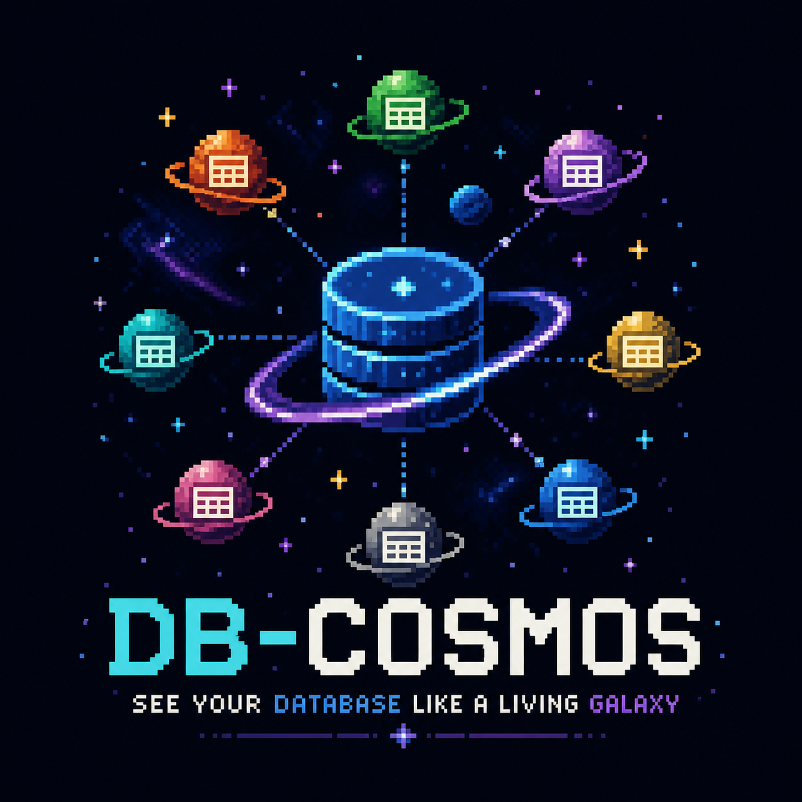

<p align="center">
  
</p>

<h1 align="center">db-cosmos</h1>
<p align="center"><em>See your database like a living galaxy.</em></p>

<p align="center">
  A 3D real-time database observatory. Watch your tables orbit, pulse, and glow as live queries flow through them.<br/>
  Not an admin tool. Not a SQL editor. Pure observation.
</p>

---

## Quick Start

```bash
git clone https://github.com/alesmo18/db-cosmos
cd db-cosmos
npm install

# Option A — full demo with Pagila or Northwind (requires Docker)
docker compose up -d
npm run dev

# Option B — no Docker; SQLite fallback activates automatically
npm run dev
```

Open **http://localhost:5173**, click **✦ Pagila** or **✦ Northwind** in the connection form.

---

## Demo Databases

Two Postgres demo databases ship out of the box. Start them with a single command:

```bash
docker compose up -d
# pagila   → localhost:5433   (movie rental, 15 tables)
# northwind → localhost:5434  (trading company, 11 tables)
```

| Demo | Schema | Tables | Port |
|---|---|---|---|
| **Pagila** | Movie rental (film, actor, rental, payment…) | 15 | 5433 |
| **Northwind** | Trading company (orders, products, customers…) | 11 | 5434 |

If Docker is not running the app falls back silently to an in-memory **SQLite** demo (StackOverflow-style, 9 tables). The HUD shows `⚠ Docker unavailable` in that case.

### Environment variable overrides

| Variable | Default | Description |
|---|---|---|
| `DEMO_PAGILA_HOST` | `localhost` | Pagila Postgres host |
| `DEMO_PAGILA_PORT` | `5433` | Pagila Postgres port |
| `DEMO_PAGILA_DB` | `pagila` | Pagila database name |
| `DEMO_PAGILA_USER` | `pagila` | Pagila user |
| `DEMO_PAGILA_PASSWORD` | `pagila` | Pagila password |
| `DEMO_NW_HOST` | `localhost` | Northwind Postgres host |
| `DEMO_NW_PORT` | `5434` | Northwind Postgres port |
| `DEMO_NW_DB` | `northwind` | Northwind database name |
| `DEMO_NW_USER` | `northwind` | Northwind user |
| `DEMO_NW_PASSWORD` | `northwind` | Northwind password |

---

## Connecting to Your Own Database

Fill in the form after clicking **connect** in the top-right corner. Supported:

| Database | Connection | Live query stream |
|---|---|---|
| **PostgreSQL** | ✅ | ✅ `pg_stat_activity` |
| **MySQL** | ✅ | ⚠ `SHOW PROCESSLIST` (text-parsed) |
| **SQLite** | ✅ | ⚠ Simulated / limited |

---

## Architecture

```
browser                   node (port 3001)          DB
──────────────────────    ──────────────────────    ──────────────
ForceGraph3D (Three.js)   Express HTTP              PostgreSQL
Zustand store         ←── WebSocket server      ←── pg_stat_activity
WS client             ──→ poll loop (1–10 Hz)       MySQL / SQLite
engine-visual             engine-graph              pg / mysql2 / better-sqlite3
                          engine-runtime
```

### Packages (monorepo)

```
db-cosmos/
├── shared/          TypeScript types (GraphNode, TableMetrics, WsMessage…)
├── connectors/      pg / mysql2 / better-sqlite3 drivers
├── engine-graph/    Schema introspection → GraphSnapshot
├── engine-runtime/  Rolling metrics & hotspot scoring
├── engine-visual/   Three.js helpers: nodes, rings, query-trail arcs
├── backend/         Express + WebSocket server, poll loop, demo mode
└── frontend/        React + Vite + react-force-graph-3d + TailwindCSS
```

---

## WebSocket Protocol

| Message type | Direction | When | Payload |
|---|---|---|---|
| `graph_snapshot` | Server → Client | On connect + schema change | `GraphSnapshot` |
| `metrics_update` | Server → Client | Every poll tick | `{ tableMetrics, timestamp }` |
| `activity_update` | Server → Client | Every poll tick (if activity) | `ActivityEvent[]` |
| `connection_status` | Server → Client | On state change | `ConnectionStatus` |
| `set_poll_interval` | **Client → Server** | On slider change | `{ intervalMs: number }` |

`set_poll_interval` is clamped server-side to **500–10 000 ms**. The HUD slider lets you dial it down to 0.5 s for high-frequency observation or up to 10 s to save load on production databases.

---

## Visual Language

| Cue | Meaning |
|---|---|
| Sphere color | Cluster membership — related tables share a hue |
| Emissive glow | Hotspot activity — brighter = more live queries |
| Orbit ring | FK relationship density |
| Billboard label | Table name + row count; fades with camera distance |
| Animated arc | Query trail between joined tables |
| Scale pulse | Active query oscillation; suppressed during camera drag |
| Dimmed nodes | Focus mode — non-relevant tables fade when one is selected |

### Table roles (visual differentiation)

| Role | Visual | Detected by |
|---|---|---|
| `REF` reference | Small, smooth, single ring | name ends `_type`, `category`, `status`… |
| `JXN` junction | Flattened sphere, double ring | name ends `_film`, `inventory`, high fan-in |
| `TXN` transactional | Large, rougher surface, 4 satellite beads | `payment`, `rental`, large row count |
| `DIM` dimension | Medium, 2 satellite beads | `customer`, `staff`, `actor`, `address`… |

### Zoom levels

| Level | Distance | Behaviour |
|---|---|---|
| **L1 GALAXY** | > 550 | All tables; labels for hot nodes only |
| **L2 ORBIT** | 90–550 | Click a node → camera tweens to it; neighbours bright, rest dimmed |
| **L3 INSPECTION** | < 90 | Full labels; side panel with columns + sample rows |

---

## Hotspot Score

```
hotspot = queryFrequency(10 s avg)  × 0.5
        + activeQueries(concurrent)  × 0.4
        + relationDensity(FK count)  × 0.1
```

Saturates at 10 qps / 5 concurrent / 10 FK relations.

---

## Why This Exists

Most database tools show you a table of tables. We show you a universe.

When you have 80 tables and 200 foreign keys, "database schema" stops being a list and starts being a **topology**. db-cosmos renders that topology live — nodes pulsing with real query load, arcs tracing the paths your joins take at runtime.

*Which tables are getting hammered right now? Where does query pressure originate? What is the relationship gravity of my schema?*

No CRUD. No SQL editor. Just the signal.

---

## License

MIT
